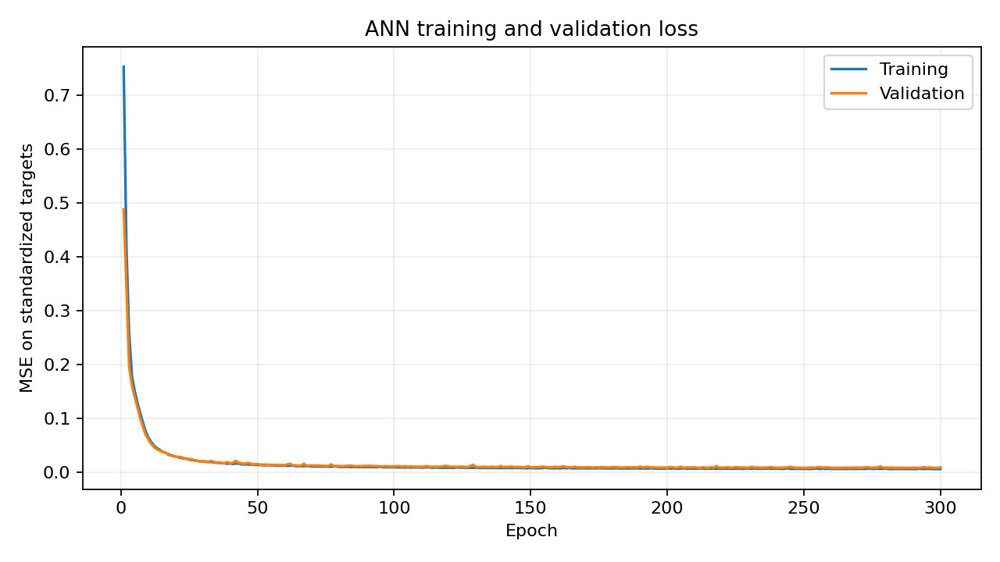
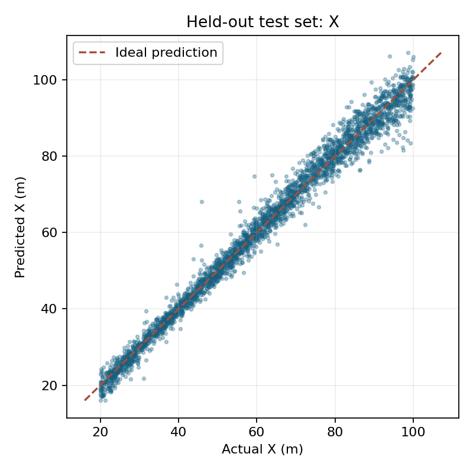

# Vision-Based Relative Pose Estimation for Autonomous Formation Flying

A third-year B.Tech machine learning mini-project: synthetic camera keypoints → a PyTorch ANN → relative position and roll. The complete dataset, trained checkpoint, and plots are included for a local faculty demonstration.

## Problem and objective

Formation flying means aircraft maintain a relative arrangement. A follower observing a leader needs the leader's relative position and orientation. This experiment learns to estimate **X (forward distance), Y (rightward lateral displacement), Z (upward vertical displacement), and roll**, from synthetic visual observations. This is an academic demonstration, not a flight-control system.

## Reference-paper inspiration

The supplied paper is Rohan Punnoose's *Vision-Based Precision Pose Estimation For Autonomous Formation Flying*, in `reference/ML-Flying.pdf`. Its structural-feature ANN uses 14 points, 42 inputs, two 100-neuron hidden layers, ReLU, Adam, and a 4,800-class softmax output (section IV.D). It also describes a particle filter and assumes a feature detector; detector development is outside that paper's project scope.

**The reference work formulates coarse pose estimation as classification. For this undergraduate mini-project, we retain the structural-feature ANN concept but formulate pose estimation as continuous multi-output regression.** We use our own simplified geometry and fixed camera. We do not reproduce the complete particle-filter pipeline, gimballed camera, dynamics, or paper's coordinate ranges. Our images/keypoints are synthetic; we do not perform real CNN keypoint detection or implement flight control.

The supplied university guidelines require source code in a private GitHub repository shared with faculty, a PDF write-up, slides, and a live demo. Their heading says one page while their body says two pages; confirm the required length with faculty. The Markdown summary here is a starting point for that later write-up. No repository has been created online or shared, and no slides or final submission PDF are claimed.

## Synthetic data and camera model

`src/utils.py` fixes 14 body-frame points in metres. The aircraft is symmetric about its lateral axis; it has a 14 m span, 10 m longitudinal extent, and a vertical tail point. Identified point order is fixed. The camera is at the follower's origin, looking along **+X**; **+Y** points right and **+Z** points up. Roll is a right-hand rotation about +X. Pitch and yaw remain zero.

For a body point `(xb, yb, zb)` and roll `r`:

```text
xc = xb + X
yc = cos(r)*yb - sin(r)*zb + Y
zc = sin(r)*yb + cos(r)*zb + Z
u  = cx + fx*yc/xc
v  = cy - fy*zc/xc
```

Image v increases downward. Points with `xc <= 0` or outside image bounds are invisible. Camera parameters: **1280 × 720 px**, **fx = fy = 400 px**, principal point **(640,360)**. This corresponds to approximately 116° horizontal and 84° vertical field of view. The wide angle accommodates the requested ranges without changing them.

Uniform independent candidate poses use X **20–100 m**, Y **−20 to +20 m**, Z **−10 to +10 m**, roll **−45° to +45°**. Seed: **42**. Add independent Gaussian coordinate noise with **2 px standard deviation**; drop each point independently with probability **0.10**. Recheck frame bounds after noise. Require **at least eight visible points**. Random dropping approximates occlusion/missed detections; it is not a physical self-occlusion calculation.

The executed generator accepted **20,000** of **20,002** candidates. Conditioning on sufficient visibility technically changes the uniform candidate distribution, although only two candidates were rejected here. Accepted observations have **12.60095** visible points on average and a **9.9932%** missing-feature fraction. The CSV has **46 columns**, no null/non-finite values, and no duplicate rows. Validation reports all target ranges and the visible-count distribution in `results/dataset_validation.json`.

## Exact input and output schema

Each point contributes `(normalized u, normalized v, visible)` in this exact order:

| Point | Structural location | Three consecutive input columns |
|---|---|---|
| 1 | Nose | `p1_x`, `p1_y`, `p1_visible` |
| 2 | Front fuselage | `p2_x`, `p2_y`, `p2_visible` |
| 3 | Center | `p3_x`, `p3_y`, `p3_visible` |
| 4 | Rear fuselage | `p4_x`, `p4_y`, `p4_visible` |
| 5 | Tail | `p5_x`, `p5_y`, `p5_visible` |
| 6 | Left wing root | `p6_x`, `p6_y`, `p6_visible` |
| 7 | Left wing middle | `p7_x`, `p7_y`, `p7_visible` |
| 8 | Left wing tip | `p8_x`, `p8_y`, `p8_visible` |
| 9 | Right wing root | `p9_x`, `p9_y`, `p9_visible` |
| 10 | Right wing middle | `p10_x`, `p10_y`, `p10_visible` |
| 11 | Right wing tip | `p11_x`, `p11_y`, `p11_visible` |
| 12 | Left stabilizer | `p12_x`, `p12_y`, `p12_visible` |
| 13 | Right stabilizer | `p13_x`, `p13_y`, `p13_visible` |
| 14 | Vertical tail | `p14_x`, `p14_y`, `p14_visible` |

Normalize `u_norm = 2*u/1280 - 1`, `v_norm = 2*v/720 - 1`. Invisible points are exactly `(0,0,0)`; visible points have flag 1. Zero coordinate alone does not signify missingness. Coordinates are already normalized and receive no further scaling.

Four targets/output order: **`target_x`, `target_y`, `target_z`, `target_roll`**, returned as **`[X, Y, Z, Roll]`** in metres/metres/metres/degrees. Ground-truth values are excluded from the model's input.

## Splitting, architecture, and training

Seed-42 permutation splits observations into **14,000 training / 3,000 validation / 3,000 test**. Persisted indices are mutually exclusive and cover every row. `StandardScaler` fits each output **only on training targets**. The test set is never read by the training loop or checkpoint selection. Dataset SHA-256 metadata helps prevent mixing generated datasets and saved checkpoints.

```text
Linear(42,100) → ReLU → Linear(100,100) → ReLU → Linear(100,4)
```

The network has **14,804 trainable parameters**. Training uses PyTorch on CPU, Adam, learning rate **0.001**, batch size **256**, standardized-target MSE, seed **42**, maximum **300 epochs**, and early-stopping patience **40**. This run completed all 300 epochs. Best validation epoch: **299**, loss **0.00755544**. Epoch-1 validation loss was **0.488323**. Saving depends only on validation loss; evaluation reloads the best checkpoint. Three-epoch smoke artifacts are saved separately.

`src/predict.py` loads the checkpoint and target scaler, validates the 42-feature observation, predicts standardized outputs, and inverse-transforms them. Streamlit uses this same class without separate inference mathematics.

## Executed results

Held-out test set: **3,000** observations. Pearson correlations between actual and predicted outputs are:

| X | Y | Z | Roll |
|---|---|---|---|
| 0.9928 | 0.9984 | 0.9983 | 0.9955 |

For each sample, position error is `sqrt((pred_x−x)^2+(pred_y−y)^2+(pred_z−z)^2)` and roll error is `abs(pred_roll−roll)`. Across test samples, the **median position error is 1.5655 m** (90th percentile **4.4958 m**); **median roll error is 1.4031°** (90th percentile **3.8048°**). These summarize individual sample errors; the demo displays only the selected sample's differences and two error cards.

Example unseen CSV row **10385**:

| Variable | Ground truth | Prediction | Absolute difference |
|---|---:|---:|---:|
| X (m) | 44.81 | 42.69 | 2.12 |
| Y (m) | 4.26 | 4.23 | 0.03 |
| Z (m) | −8.54 | −8.60 | 0.07 |
| Roll (°) | −26.25 | −25.61 | 0.64 |

Values above are rounded from executed predictions. `results/test_predictions.csv` preserves all test outputs. Predictions vary across poses, with output standard deviations close to the actual target standard deviations; the model has not collapsed to an average pose. Scatter plots show strong diagonal agreement with some outliers, especially in depth. These results describe interpolation within this synthetic generator, not real-flight accuracy.




Other results: `aircraft_keypoints.png`, six `dataset_samples/sample_*.png`, `predicted_vs_actual_y.png`, `predicted_vs_actual_z.png`, `predicted_vs_actual_roll.png`, `training_history.csv`, `training_summary.json`, `dataset_validation.json`, `evaluation_summary.json`, and `sample_predictions.csv`. The sample figures include a full frame and zoom. Missing-point crosses are explicitly labelled ground-truth overlays and are never passed to inference.

## Installation and exact reproduction commands

Run from the repository root in a Windows terminal, using Python 3.10 or newer:

```powershell
python -m venv .venv
.venv\Scripts\activate
python -m pip install -r requirements.txt
python src/generate_dataset.py
python src/validate_dataset.py
python src/preprocessing.py
python src/train.py --epochs 3 --smoke
python src/train.py
python src/evaluate.py
python src/predict.py
python -m unittest discover -s tests -p "test_*.py"
python tests/check_app.py
streamlit run app.py
```

PowerShell alternative activation: `.\.venv\Scripts\Activate.ps1`. If activation is disabled, invoke `.venv\Scripts\python.exe` directly and launch with `.venv\Scripts\python.exe -m streamlit run app.py`. On macOS/Linux, activate with `source .venv/bin/activate`.

The dataset and model are already generated; after dependency installation, you can go directly to `streamlit run app.py`. Open the localhost URL printed by Streamlit. Regenerating data or changing the generator requires rerunning training and evaluation. Keep the model and scaler together. Only load model/scaler files you trust.

Optional generator settings: `python src/generate_dataset.py --samples 20000 --noise 2 --occlusion 0.1`. Training settings: `--epochs`, `--batch-size`, `--lr`, `--patience`. The integration tests assume the default 20,000-observation experiment.

Executed environment: Python **3.10.11**, NumPy **2.2.6**, pandas **2.3.3**, matplotlib **3.10.8**, scikit-learn **1.7.2**, PyTorch **2.13.0+cpu**, joblib **1.5.3**, Streamlit **1.64.0**. Determinism is configured for CPU; exact floating-point outcomes can differ with library/platform changes.

In this workspace, Streamlit was installed into ignored `.local-deps/` to avoid altering global packages. For that existing installation only, launch without installing again:

```powershell
python run_demo.py
```

## Streamlit demonstration

Four pages: **Home**, **Try the Model** (opens first), **Model Performance**, and **How It Works**. Custom controls describe distance ahead, left/right offset, height difference, and aircraft bank. Five quick presets populate the sliders; a form applies the scenario only when **Generate Camera View & Predict** is pressed. The submitted scenario is labelled separately from draft controls. Noise, missingness, and a repeatable observation seed (default 42) are inside Advanced simulation settings. The shared `observe_pose` function in `src/utils.py` performs the same projection, Gaussian noise, missingness, and normalization as dataset generation. Only its 42 features enter `PosePredictor.predict`; true pose is held separately for comparison. If fewer than eight points survive, the demo retries observation corruption at the same physical pose.

What the Model Sees shows top and side aircraft schematics plus a true-versus-predicted roll indicator. Solid blue represents truth; dashed orange outlines represent the actual ANN output. One large camera visualization automatically frames the detected aircraft with padding and a camera-center reference; **Show full camera frame** restores 1280 × 720 bounds. Detected markers decode the exact ANN feature vector, and the fixed skeleton connects only those observed points. Optional missing-point truth overlays are labelled and never enter inference. A compact comparison table uses language such as “15 m left” and “8 m above,” followed by the selected sample's position/roll error cards. The secondary Unseen Test Sample mode offers a random button and ID selector exclusively from the persisted test split.

Model Performance renders `training_history.csv` with Plotly and computes R² using the saved ANN on all 3,000 held-out test rows: **X 0.985520, Y 0.996718, Z 0.996571, roll 0.990956**. These are regression scores, not classification accuracy. How It Works contains the technical explanation and optional geometry/raw-data expanders. Use `docs/DEMO_SCRIPT.md` for a two-minute flow and `docs/VIVA_QA.md` for preparation. Plotly is included in `requirements.txt`; no retraining is needed for these UI changes.

## Repository structure

```text
ML-Mini-Project/
├── app.py
├── run_demo.py                # optional local launcher
├── requirements.txt
├── README.md
├── .gitignore
├── reference/                 # supplied paper and university guidelines
├── src/
│   ├── __init__.py
│   ├── utils.py               # geometry, camera, plotting, reproducibility
│   ├── generate_dataset.py
│   ├── validate_dataset.py
│   ├── preprocessing.py
│   ├── model.py
│   ├── train.py
│   ├── evaluate.py
│   ├── demo_visuals.py        # live Plotly formation, camera, and loss views
│   ├── demo_controls.py       # human-readable labels and quick presets
│   └── predict.py
├── data/
│   ├── raw/                   # synthetic CSV and generation_config.json
│   └── processed/             # split_indices.npz and split_metadata.json
├── models/                    # best_model.pt, target_scaler.joblib, smoke model
├── results/                   # plots, histories, reports, prediction CSVs
│   └── dataset_samples/       # six validated observations
├── docs/
│   ├── PROJECT_SUMMARY.md
│   ├── DEMO_SCRIPT.md
│   └── VIVA_QA.md
└── tests/
    ├── test_pipeline.py
    ├── test_demo.py
    └── check_app.py
```

Dataset size: approximately **13.2 MB**; final checkpoint: approximately **63 KB**. Useful results, data, and models remain available. Environments, cache files, dependency staging, and temporary files are ignored.

## Verification and limitations

Actually executed: generation and validation; saved preprocessing; smoke/full training; held-out evaluation; checkpoint loading; ten passing integration tests; Streamlit AppTest across X 25/90 m, Y ±15 m, Z ±8 m, and roll ±40°. Checks include all five presets, submitted-versus-draft state, four physical/camera charts, auto/full camera framing, both held-out selectors, exact plot/input correspondence, and a PyTorch input hook receiving only 42 features. SHA-256 checks confirm the dataset, checkpoint, and scaler remain unchanged during this presentation redesign. `results/custom_demo_verification.json` stores actual predictions and completed checks. `results/verification_report.json` records the original workflow.

Limitations: one fixed known aircraft size/geometry, calibrated fixed camera, known feature identities, zero pitch/yaw, simplified independent missingness, mild pixel noise, and uniformly proposed synthetic poses. A monocular depth estimate depends on known object scale. Repeated axial features can overlap in a frontal projection. Long-distance observations occupy fewer pixels and are more noise-sensitive. Outputs have no uncertainty estimate and are not constrained to the target intervals. Performance outside the training ranges or on actual photographs is unverified. Random train/test splitting is appropriate to independent synthetic observations, but does not test a new aircraft or camera domain.

Future work: evaluate stronger noise and systematic occlusion, different geometry/camera parameters, add pitch/yaw, gather labelled real keypoints, and separately study temporal filtering. These are future extensions, not implemented claims.

## Team contribution placeholders

| Member | Name / USN | Contributions to complete honestly |
|---|---|---|
| 1 | [Name / USN] | [Actual design, code, experiments, or presentation work] |
| 2 | [Name / USN] | [Actual design, code, experiments, or documentation work] |

Both members should be able to explain the geometry, split, scaler, training loop, and test-only demo. Add any required acknowledgement of tools used according to course policy.
